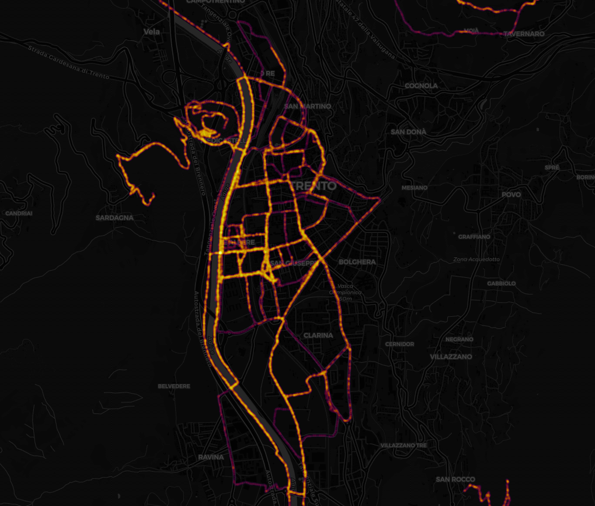
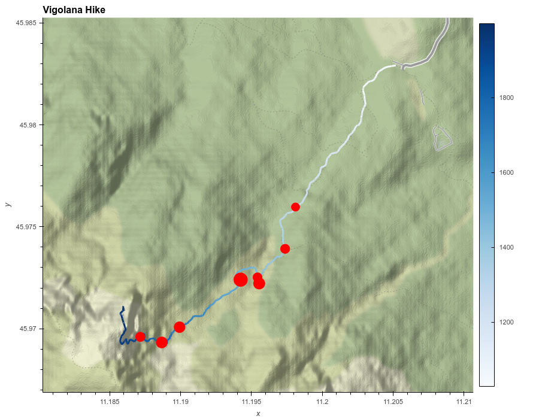

# Strava Analytics - Analysis, investigation and mapping of Strava activities  
Project for the Geospatial Analysis and Representation for Data Science course of the University of Trento.  

The purpose of this project is to analyze in different ways a number of Strava activities. Through gpx analysis, integration with other sources (e.g. OSM) and multiple data visualizations, the notebooks provided aim to get some insights that are not easy (if not impossible) to spot by simply looking at the activities path.

### Virtual environment setup and requirements

In order to to execute the project after the cloning, it is suggested to create a virtual environment and install the required modules.  
To create a virtual environment in a UNIX system, type in a terminal:

```
# Use python or python3 (depending on the recognised command)
python3 -m venv ./venv
```

Then, activate your virtual environment:

```
source venv/bin/activate
```

Finally, install all the required dependencies:

```
pip install -r requirements.txt
```

## Project structure

* In the main folder you can find the final report and the requirements needed to execute the notebooks
* `code` folder:
    * `stravaAnalytics` contains all the implemented analysis; given its length, it's been splitted in `stravaLongRideFocus`, `stravaMapping`, `stravaOSM` and `stravaEffortsTimeAnalysis`, in order;
    * `utils` set of functions and variables used for the analysis
* `code/data` folder: contains Strava activities in `.gpx` format and VO2Max data in `.json` format
* `images` folder: contains some of the images produced in the notebook

**Caveat**  
Hvplot are not always displayed on the GitHub's preview page. Some previews are displayed below and attached to the report, but to properly visualize all the plots an execution of the notebooks is strongly recommended. Every notebook features a data loading section where all the data required is loaded, hence each one of them can be separately executed.

## Analysis

### Long ride focus

Analysis of the longest bike ride of the batch. The notebook focuses on analyze the path followed during the journey and on finding reasons for the pace variations shown.

### Mapping

Different ways to represent on a map the activities considered. The notebook provides possible solutions to identify the most common routes covered during the activities and  to visualize them in a meaningful fashion (see image).



### OSM

Combination of Movingpandas' StopDetection function and Open Street Map data to explain stops taken during a specific hike (image).


### Effort Analysis

Temporal comparison between length, average pace and VO2Max variation to identify performance peaks starting from Strava activities.

## Data

All the data used comes from my personal Strava account. Activities are visible on my Strava profile (https://www.strava.com/athletes/46868988) previous connection. Any usage of gpx files is welcome and not restricted in any case.

## Contacts

For any clarification, requests or suggestions for improvements, contact me at andrea.debeni@studenti.unitn.it